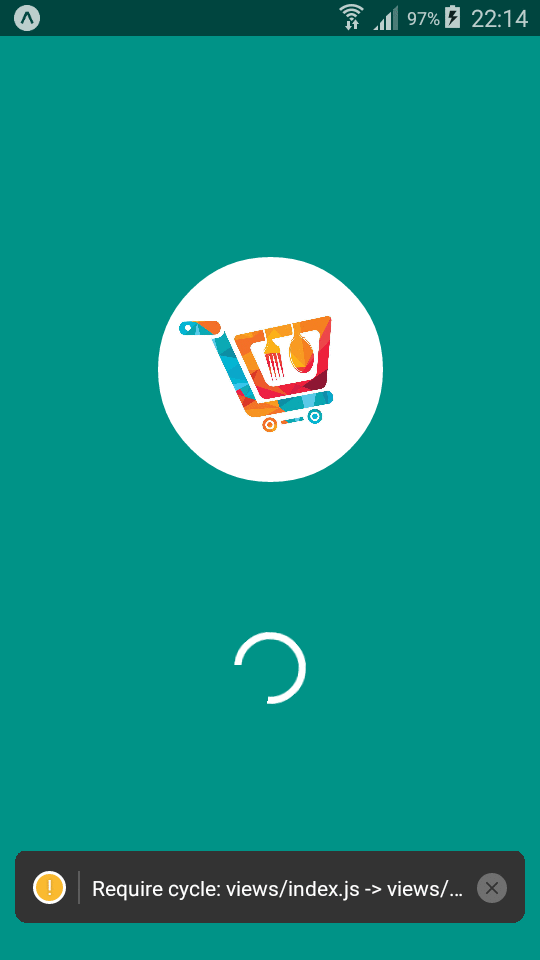

## Food Delivery App

## Usage
> Clone the reposotory in your desktop
> Open the terminal in the backend and admin-app folders and run this lines:


```
    npm install
    npm start
```
> and in the last folder ( shopeefood ) open the terminal and run this lines 
> 

```
    npm install
    npx expo start
```
you should install expo-cli 

> and thats it, the app is running
### Demo




